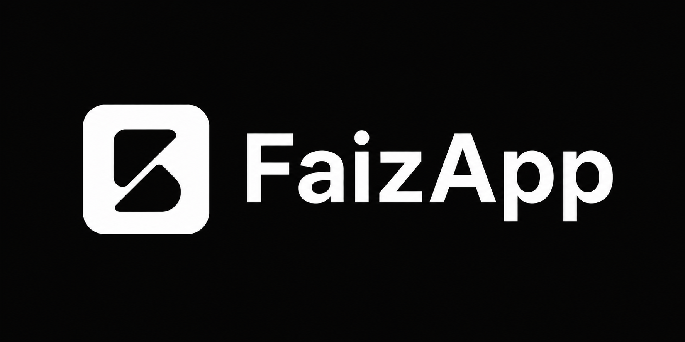

<p align="center">
  
</p>

<h1 align="center">FaizApp</h1>

<p align="center">
  Digital platform for managing, controlling, and analyzing field operations.
</p>

<p align="center">
  <strong>Telegram-based field operations management system</strong>
</p>

---

## Overview

**FaizApp** is an internal digital platform designed to manage, monitor, and analyze the daily field operations of sales representatives and merchandisers.

The system is being developed around real operational workflows within a distribution company. Its primary purpose is to reduce manual administrative work and provide a structured, auditable workflow for field reporting, merchandising control, plan tracking, comments, and operational statistics.

The initial product is implemented as a **Telegram bot**. The architecture is intentionally designed so that the system can evolve into a broader platform with a web interface, analytical dashboards, trade-point auditing, planogram management, and AI-assisted photo analysis.

### Core Principle

> **Automate counting and routine operations, but keep human judgment where visual assessment or business judgment is required.**

---

## Product Objectives

FaizApp is intended to:

- Automate field-work reporting.
- Automate counting of completed merchandising activities.
- Track individual employee plans and actual performance.
- Record violations, comments, and rejected submissions.
- Prevent duplicate processing of the same photographs.
- Send automated reminders and operational notifications.
- Generate daily and monthly performance statistics.
- Reduce manual dispatcher workload.
- Gradually transition from fully manual verification to assisted and automated analysis.

---

## Current Product Scope

### Stage 1 — Pilot Telegram Bot

The initial implementation targets a single Telegram group containing:

- Sales representatives / merchandisers.
- Dispatchers.
- Management.

At this stage, the bot **does not independently determine whether merchandising quality is acceptable**.

The dispatcher remains responsible for visual review of submitted photographs and explicitly provides the verification result to the system.

### Verification Results

Each submitted work item can receive one of three outcomes:

| Status | Meaning |
|---|---|
| `ACCEPTED` | Work is accepted and counted. |
| `ACCEPTED_WITH_COMMENT` | Work is accepted and counted, but a comment is recorded. |
| `REJECTED` | Work is not counted and is recorded as rejected. |

Business rules:

- Accepted work contributes to employee performance.
- Accepted work with a comment contributes to performance and increments the comment counter.
- Rejected work does not contribute to completed work.
- Rejected work increments rejection/comment statistics.
- Rejected submissions should generate a notification for the corresponding employee explaining the reason for the discrepancy.

---

## Photo Reporting

At the initial stage, photograph verification is performed by a human dispatcher.

FaizApp is responsible for the technical workflow around submitted media:

1. Receive photographs from Telegram.
2. Identify the sender.
3. Store required photo metadata.
4. Detect potential duplicate submissions.
5. Associate photographs with a work/reporting event.
6. Store the dispatcher's verification result.
7. Store comments and rejection information.
8. Include verified results in operational statistics.

### Duplicate Detection

The planned duplicate-detection mechanism uses:

- SHA-256 hash of the file.
- Available image metadata.
- EXIF capture date/time when available.

GPS and geolocation are **not part of the initial implementation**.

Missing EXIF metadata must **not** be treated as proof that a photograph is old, duplicated, or invalid.

---

## Users and Roles

FaizApp uses a role-based access model.

### Sales Representative / Merchandiser

A field employee can:

- Complete registration through Telegram.
- Submit photo reports.
- Receive verification results.
- Receive notifications and reminders.
- View relevant personal performance information.

### Dispatcher

A dispatcher has extended permissions to:

- Review submitted work.
- Accept or reject submissions.
- Add comments.
- Correct or confirm results.
- View operational statistics.
- Execute administrative commands.

### Management

Management consumes operational statistics and reports. During the early stages, some management reporting may continue to rely on Excel-based workflows.

Administrative operations must not be available to ordinary users.

---

## Registration

User registration is performed through Telegram.

The planned registration flow uses the user's Telegram contact to associate the Telegram identity with an internal employee record.

The system stores the required user information in PostgreSQL and maintains the relationship between:

```text
Telegram User
      ↓
Internal Employee
```

The exact registration workflow and required employee attributes will be implemented as part of the database and user-management stages.

---

## Plans and Performance

Each sales representative has an individual work plan.

A plan may contain:

- Daily target.
- Monthly target.

A team leader's team-level plan is calculated as the sum of the plans assigned to their sales representatives.

A separate personal plan for the team leader is not required during the initial stage.

The system is expected to compare planned and actual performance and use the resulting data for reminders and reporting.

---

## Automated Operational Checks

FaizApp is designed to execute scheduled checks during the working day.

The initial planned schedule is:

| Time | Operation |
|---|---|
| 10:30 | Performance check |
| 12:00 | Performance check |
| 15:00 | Performance check |
| 16:00 | End-of-day summary |

During the working day, the bot evaluates plan completion and sends reminders when required.

At 16:00, the system generates the daily operational summary.

The scheduling implementation is a planned capability and is not part of the minimal bot runtime yet.

---

## Daily Reporting

The dispatcher-facing daily report is expected to contain:

- Completed merchandising activities.
- Employee-level performance.
- Plan completion.
- Late or insufficient performance.
- Number of comments.
- Number of rejected submissions.

Management reporting will additionally provide structured data that can be used to produce Excel reports.

During the early implementation stages, part of the final reporting workflow may remain manual.

---

## Monthly Statistics

FaizApp is planned to provide monthly performance statistics including:

- Plan completion.
- Plan underperformance.
- Highest-performing employees.
- Lowest-performing employees.
- Number of completed activities.
- Number of rejected submissions.
- Number of comments.

The exact KPI definitions and reporting rules will be formalized as the business logic is implemented.

---

## Architecture

FaizApp is being developed in **Go** using a modular monolithic architecture.

```text
faizapp/
├── cmd/
│   └── bot/
│       └── main.go
│
├── internal/
│   ├── app/
│   │   └── app.go
│   │
│   ├── config/
│   │   └── config.go
│   │
│   ├── models/
│   │   ├── user.go
│   │   ├── plan.go
│   │   ├── merch.go
│   │   ├── photo.go
│   │   ├── comment.go
│   │   └── SRTerrytoriesInfo.go
│   │
│   ├── service/
│   │   ├── userservice.go
│   │   └── reference_service.go
│   │
│   ├── repository/
│   │   └── postgres/
│   │       ├── faizapp_postgres.go
│   │       └── reference_data.go
│   │
│   ├── transport/
│   │   └── telegram/
│   │       └── handlers.go
│   │
│   └── middleware/
│       └── middleware.go
│
├── migrations/
│
├── config/
│   └── .env.example
│
├── go.mod
├── go.sum
├── .gitignore
└── README.md
```

### Component Responsibilities

| Component | Responsibility |
|---|---|
| `cmd` | Application entry point. |
| `app` | Application composition and startup. |
| `config` | Environment loading, configuration construction, and validation. |
| `models` | Application data models and Telegram menu definitions. |
| `service` | Application and business logic. |
| `repository` | Persistence and PostgreSQL access. |
| `transport/telegram` | Telegram-specific handlers and transport logic. |
| `middleware` | Cross-cutting checks before update processing. |
| `migrations` | Version-controlled database schema changes. |

---

## Configuration

Runtime configuration is supplied through environment variables.

Sensitive configuration must remain outside version control.

Example:

```text
TGBOTAPI_TOKEN=
BOT_MODE=

POSTGRES_HOST=
POSTGRES_PORT=
POSTGRES_USER=
POSTGRES_PASSWORD=
POSTGRES_DB=
```

The repository contains an example configuration file, while the real `.env` file must remain local and ignored by Git.

Configuration loading and validation are isolated in `internal/config`.

---

## Technology Stack

The current technical direction includes:

- **Go** — primary application language.
- **Telegram Bot API** — initial user-facing transport.
- **PostgreSQL** — primary persistent data store.
- **Docker / Docker Compose** — local and deployment infrastructure where applicable.
- **Git / GitHub** — source control and project management.
- **Database migrations** — version-controlled schema evolution.

Additional libraries and infrastructure will be introduced only when required by the implementation.

---

## Development Principles

### Separation of Responsibilities

Telegram transport, business logic, persistence, configuration, and application startup should remain independently organized.

### Explicit Business Logic

Business rules should be represented explicitly in application/domain logic rather than hidden inside Telegram handlers or database queries.

### Human-Controlled Verification

Automated systems should assist with repetitive technical operations without silently replacing business decisions that require human visual judgment.

### Auditability

Important operational actions should be traceable, especially:

- Verification results.
- Rejections.
- Comments.
- Corrections.
- User-role changes.
- Relevant administrative actions.

### Incremental Development

The system is developed in small, verifiable stages. New infrastructure should not be introduced before it is required by the current stage.

---

## Development Roadmap

### Stage 1 — Minimal Telegram Runtime

- Telegram bot initialization.
- Polling-based update processing.
- `/start` interaction.
- Basic handler structure.
- Initial project architecture.

### Stage 2 — Application Foundation and Access Workflows

#### Stage 2.1 — Configuration — Completed

- `.env` based configuration.
- Telegram configuration.
- PostgreSQL configuration model.
- Configuration validation.
- Centralized configuration loading.
- Passing the resulting configuration into the application layer.

#### Stage 2.2 — PostgreSQL Foundation — Completed

- PostgreSQL connection.
- Connection pool.
- Database connectivity validation.
- Migration infrastructure.
- Initial database schema and versioned migrations.

#### Stage 2.3 — User Registration and Approval — Completed

- Telegram identity handling.
- Contact-based registration.
- Employee records.
- Pending user persistence.
- Administrator approval/rejection through Telegram inline buttons.
- Role selection for approved users.
- Administrator-only callback handling.

#### Stage 2.4 — Territory and SR Assignment — Completed

- Work groups and territories.
- Brand categories and SR codes.
- Available-code lookup by territory.
- Sales representative workflow:

  ```text
  Role → Work group → Territory → SR code → Approve
  ```

- Supervisor workflow:

  ```text
  Role → Work group → Territory → Assign territory → Approve
  ```

- Transactional assignment of SR codes and supervisor territories.
- Protection against assigning an occupied SR code or territory.
- Service-layer tests and manual end-to-end testing of both workflows.

#### Stage 2.5 — Core Domain

Planned entities include:

- Users / employees.
- Plans.
- Merchandising activities.
- Photos.
- Comments.
- Verification results.

#### Stage 2.6 — Photo Reporting

- Telegram photo reception.
- Photo persistence.
- File hashing.
- Duplicate detection.
- Sender association.
- Report/work association.

#### Stage 2.7 — Dispatcher Verification

- Accept.
- Accept with comment.
- Reject.
- Dispatcher comments.
- Employee notifications.
- Corrected statistics.

### Stage 3 — Operational Automation

- Scheduled checks.
- Reminders.
- End-of-day reports.
- Plan tracking.
- Employee performance summaries.

### Stage 4 — Reporting and Analytics

- Daily reports.
- Monthly statistics.
- Management reporting.
- Excel-compatible reporting workflows.
- Historical performance analysis.

### Stage 5 — Advanced Platform Capabilities

Potential future capabilities:

- Web application.
- Personal dashboards.
- Trade-point auditing.
- Planogram management.
- Advanced analytics.
- AI-assisted photograph analysis.

These capabilities are intentionally outside the initial implementation scope.

---

## Current Development Status

The project has completed the application foundation and the first administrative access workflows.

Implemented:

- Telegram polling bot and application startup.
- Environment-based configuration with validation.
- PostgreSQL connection pool and versioned migrations.
- User registration through Telegram contact sharing.
- Pending, approved, and rejected user states.
- Administrator-only approval callbacks.
- Role selection through inline keyboards.
- Work-group and territory lookup from PostgreSQL.
- Sales representative SR-code assignment.
- Supervisor territory assignment.
- Transactional persistence for approval and assignment operations.
- Service-layer tests and manual end-to-end testing of both assignment workflows.
- Protected `main` branch with Pull Request and CI requirements; changes are intended to flow through `develop`.

The next major implementation target is the photo-reporting foundation: receiving Telegram photos, storing metadata, calculating file hashes, and preventing duplicate submissions.

Not implemented yet:

- Photo/report database tables and photo ingestion.
- Duplicate detection in the production workflow.
- Dispatcher verification of submitted photos.
- Comments, rejection reasons, and report counters.
- Plans, scheduled reminders, daily summaries, and monthly analytics.
- Supervisor-specific management screens and reporting.

---

## Security

The following rules are mandatory:

- Never commit `.env` files.
- Never commit Telegram bot tokens.
- Never commit database passwords.
- Never place production credentials in source code.
- Keep `.env.example` free of real secrets.
- Rotate credentials immediately if they are accidentally exposed.

---

## Repository Workflow

The project uses Git and GitHub for source control and project management.

The repository should maintain:

- Clean, focused commits.
- Meaningful commit messages.
- Reviewable changes.
- Version-controlled migrations.
- No credentials or local runtime secrets.

GitHub Projects and Issues are used to track implementation stages, tasks, technical work, and progress.

---

## Status

**Active development**

FaizApp is currently progressing from the minimal Telegram runtime toward its PostgreSQL and user-management foundation.

---

## License

Internal project. No public license has been defined at this stage.
